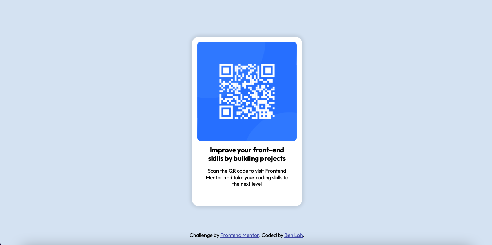

# Frontend Mentor - QR code component solution

This is a solution to the [QR code component challenge on Frontend Mentor](https://www.frontendmentor.io/challenges/qr-code-component-iux_sIO_H). Frontend Mentor challenges help you improve your coding skills by building realistic projects. 

## Table of contents

- [Overview](#overview)
  - [Screenshot](#screenshot)
  - [Links](#links)
- [My process](#my-process)
  - [Built with](#built-with)
  - [What I learned](#what-i-learned)
  - [Continued development](#continued-development)
  - [Useful resources](#useful-resources)
- [Author](#author)
- [Acknowledgments](#acknowledgments)

## Overview

### Screenshot

### Links

- Solution URL: [Add solution URL here](https://your-solution-url.com)
- Live Site URL: [Add live site URL here](https://your-live-site-url.com)

## My process

### Built with

- HTML
- CSS
- VS Code (Visual Studio Code)

### What I learned

Overall, this challenge was a piece of cake, since it only tests the fundementals of front end. Though, the hardest challenge I face is to make it responsive. Through testing the responsiveness of the page in various browser sizes and making any necessary changes, I was able to successfully overcome my struggle. It was a fun project and I learned how to use different width and height units, as long as the max-width property.

### Continued development

I will learn more properties and technique that I could make a website more responsive through YouTube videos and webpages. It will make me better and more comfortable in making a page responsive effortlessly and effectively.

### Useful resources

- [w3schools](https://www.w3schools.com/html/html_responsive.asp) - This helped me understand what making a website responsive really is. I've learnt some CSS units and attributes, like view width and percentages.
- [w3schools](https://www.w3schools.com/css/css_boxmodel.asp) - This helped me to learn how to position my elements within a container, using properties like margin and padding.

## Author
- Frontend Mentor - [@CodeDreamerBen](https://www.frontendmentor.io/profile/CodeDreamerBen)